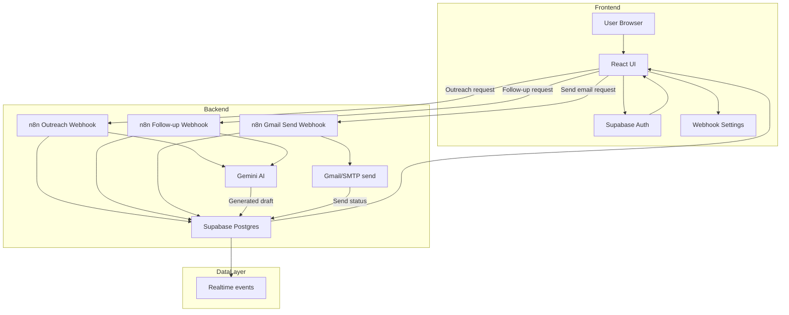

# ServeOS Architecture

## Overview

ServeOS is an AI-powered CRM automation prototype built as a modern workflow stack. The system combines:

- Frontend UI and authentication in React + TanStack + Vite
- Supabase for user auth, Postgres storage, and realtime event delivery
- n8n automation flows for AI draft generation and email sending
- Gemini AI for outreach and follow-up content generation
- Lovable-powered Vite configuration and Cloudflare Worker SSR support

This architecture document describes how these pieces interact to provide end-to-end workflow automation.

## Core components

### 1. Frontend (ServeOS CRM)

Location: `FrontEnd/ServeOS CRM/`

Responsibilities:

- Client authentication and session management via Supabase
- Customer CRM interface for clients, drafts, reminders, and activity history
- Outreach draft generation, follow-up workflow triggers, and send controls
- Persistent settings for webhook endpoints stored in browser local storage
- Runtime environment built with Vite and Lovable config
- SSR entrypoint via Cloudflare Worker defined in `wrangler.jsonc`

Key files:

- `src/integrations/supabase/client.ts` — Supabase client used by browser code
- `src/integrations/supabase/client.server.ts` — Server-side Supabase client with service role key for trusted operations
- `src/lib/outreach.ts` — Webhook helpers, AI response sanitization, email/send workflow support
- `src/routes/_app.settings.tsx` — Settings page for saving n8n webhook URLs
- `src/routes/_app.outreach.tsx` — Outreach draft workflow and send UI
- `src/routes/_app.engagement.tsx` — Engagement center and active reminders
- `src/routes/_app.history.tsx` — Activity timeline and event history

### 2. Supabase

Supabase provides the system data layer and realtime backend:

- Auth: user sign-up, sign-in, session refresh, and secure client-side auth
- Database: `outreach_drafts`, `activity_history`, `follow_ups`, `clients`, `profiles`, and related tables
- Realtime: live Postgres subscriptions update the UI automatically
- REST API: n8n workflows write generated drafts, follow-ups, and history logs via Supabase REST endpoints
- Server-side admin operations: `SUPABASE_SERVICE_ROLE_KEY` used only in server-side code

Supabase is the source of truth for the CRM state and acts as the central event bus for frontend updates.

### 3. n8n automation workflows

Location: `BackEnd/`

The backend automation layer is defined as n8n workflow export files. The workflows handle:

- Outreach draft generation (`ServeOS - Outreach AI Engine.json`)
- Follow-up generation (`ServeOS-FollowUp-Generator.json`)
- Gmail email sending (`ServeOS — Gmail Send Engine.json`)

Each workflow is triggered by a webhook call from the frontend. The frontend stores webhook URLs in settings and calls them when users request AI drafts or send emails.

### 4. Gemini AI

Gemini is the AI model used inside the n8n workflows for draft generation. The workflows include:

- `@n8n/n8n-nodes-langchain.lmChatGoogleGemini`
- `@n8n/n8n-nodes-langchain.agent`

These nodes construct AI prompts and send them to Gemini models such as `models/gemini-2.5-flash-lite`.

Gemini output is normalized and sanitized before being written back into Supabase as draft content.

### 5. Lovable

Lovable is used as a development and configuration layer for the frontend tooling:

- `FrontEnd/ServeOS CRM/vite.config.ts` imports `@lovable.dev/vite-tanstack-config`
- `FrontEnd/ServeOS CRM/package.json` includes `@lovable.dev/vite-tanstack-config`
- Lovable messages appear in generated Supabase integration code

Lovable provides opinionated Vite and TanStack defaults, server integration support, and local developer workflow support.

## Workflow diagram

## Detailed automation flows

### Outreach generation

1. The user requests an outreach draft from the frontend.
2. The frontend loads the configured n8n outreach webhook URL from browser storage.
3. It posts the client context and prompt details to n8n.
4. n8n uses Gemini to generate subject/body/tone/strategy/cta.
5. The workflow stores the result in Supabase `outreach_drafts` and logs activity in `history_logs`.
6. Supabase realtime subscriptions update the frontend immediately.

### Follow-up generation

1. The user triggers a follow-up workflow from the engagement centre.
2. The frontend calls the n8n follow-up webhook with reminder and client context.
3. n8n runs Gemini and generates a follow-up draft.
4. The workflow writes the follow-up draft and reminder state to Supabase.
5. The frontend reflects the new reminder and engagement activity.

### Email send flow

1. The user sends an outreach or follow-up email from the frontend.
2. The frontend calls the configured n8n Gmail send webhook.
3. n8n may fetch related draft or reminder data from Supabase.
4. The workflow sends the message via Gmail/SMTP.
5. Success or failure is written back to Supabase and logged in `history_logs`.

## Data flow and security

- Webhooks are configured in user settings and stored in browser local storage; they are not hard-coded.
- Supabase keys are stored in environment variables and `.env` is ignored in version control.
- The frontend uses `import.meta.env.VITE_SUPABASE_URL` and `VITE_SUPABASE_PUBLISHABLE_KEY` for client auth.
- Server-side code uses `process.env.SUPABASE_URL` and `SUPABASE_SERVICE_ROLE_KEY` only for trusted operations.
- AI outputs are sanitized in `src/lib/outreach.ts` before rendering.

## Key integration points

- `src/integrations/supabase/client.ts` — client-side connection to Supabase
- `src/integrations/supabase/client.server.ts` — admin service-role Supabase client
- `src/lib/outreach.ts` — webhook helpers and AI sanitize/parse logic
- `src/routes/_app.settings.tsx` — webhook onboarding and runtime configuration
- `BackEnd/*.json` — n8n workflow definitions that connect Gemini and Supabase

## Deployment notes

- Frontend deploys as a Cloudflare Worker SSR app via `wrangler.jsonc`
- n8n workflows are deployed separately in an n8n instance
- Supabase runs as the backend data store and auth provider
- Gemini credentials are managed by n8n and not stored in frontend code

## Summary

ServeOS is designed as a loosely-coupled automation platform:

- UI and auth live in the frontend
- persistent state lives in Supabase
- AI generation and email delivery live in n8n
- Gemini provides the natural-language content engine
- Lovable provides the frontend build and configuration foundation

This architecture separates concerns cleanly and enables the CRM to scale by replacing individual workflow components without changing the core UI.
