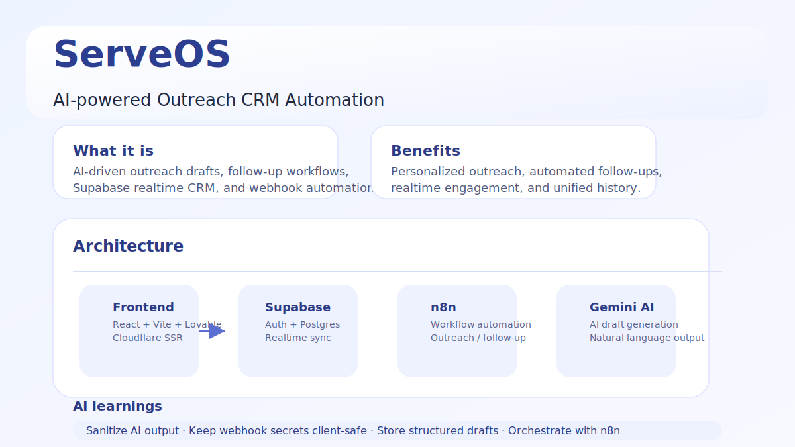
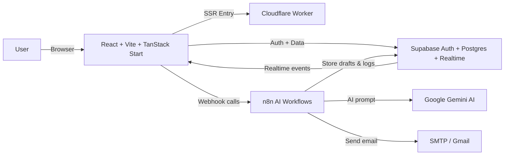
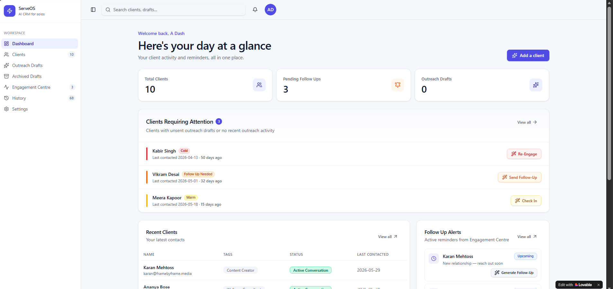
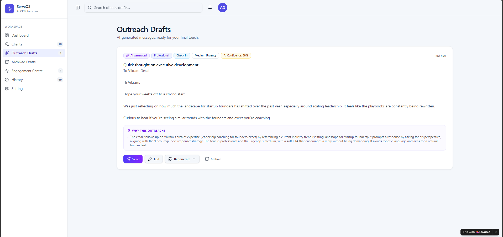
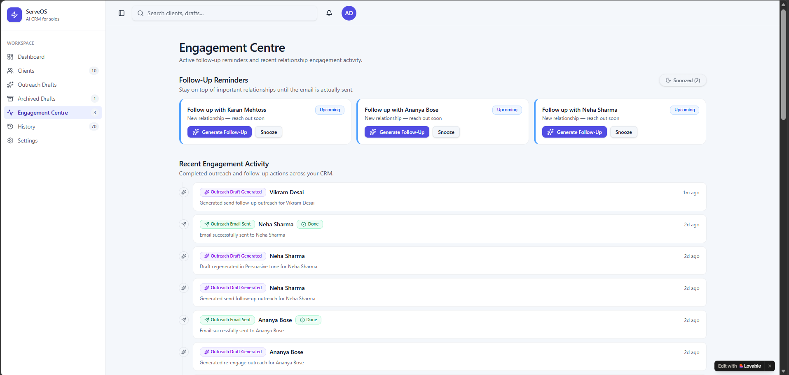
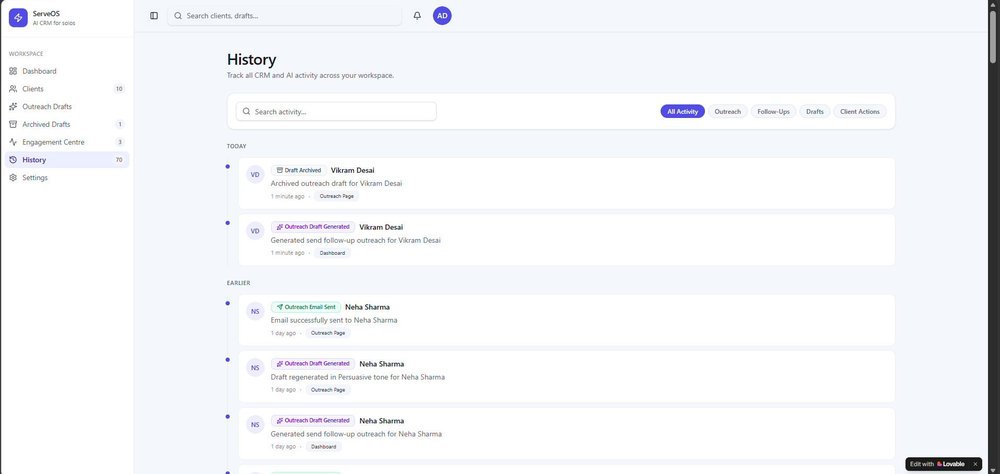

# ServeOS



ServeOS is an AI-powered outreach CRM built for modern sales, client success, and growth teams. It combines real-time Supabase data, AI draft generation, follow-up automation, and Cloudflare Worker delivery into a polished SaaS-style workspace.

## 🚀 What it does

- Generates sales/outreach email drafts and follow-up templates with AI
- Stores and tracks clients, outreach drafts, reminders, and activity history
- Sends emails via webhook-connected Gmail automation
- Provides a unified engagement centre to manage active follow-ups
- Uses Supabase for auth, database, and realtime UI updates
- Uses Cloudflare Worker + Vite for server-rendered front-end delivery

## 🌟 Highlights

- AI outreach and follow-up suggestions
- CRM client tracking and interaction history
- Realtime activity feed and reminders
- Draft editing and email send workflow
- Local webhook configuration for n8n / Gmail send integration
- Clean modern UI using TanStack React Start and custom design system

## 🏗️ Solution architecture



## 🧩 Repository structure

- `FrontEnd/ServeOS CRM/` — React app, Supabase integration, UI, Cloudflare Worker config
- `BackEnd/` — n8n workflow exports for AI outreach, follow-up generation, and Gmail send automation
- `Screenshots/` — UI preview images for portfolio presentation

## 📌 Core features

- **Outreach Drafts**: AI-generated email drafts with subject, tone, urgency, CTA, and reasoning.
- **Engagement Centre**: Active reminders, follow-up status, and recent activity for relationship management.
- **History & Audit Trail**: Searchable activity log of drafts, sends, reminders, and client events.
- **Client CRM**: Store client metadata, tags, notes, and last contact timestamps.
- **Webhook-driven sending**: Secure webhook integration with n8n for Gmail email delivery.
- **Realtime updates**: Supabase real-time subscriptions keep UI state synchronized.
- **Draft sanitization**: Robust parsing and cleanup of AI-generated JSON/text payloads before rendering.

## 📷 Screenshots

| Overview | Dashboard | Outreach | Engagement | History |
|---|---|---|---|---|
|  |  |  |  |  |

Additional screens:

- `Screenshots/ServeOS_Clients.png`
- `Screenshots/ServeOS_Settings.png`
- `Screenshots/ServeOS_ArchivedDrafts.png`

> GIF walkthroughs can be added to `Screenshots/` as animated demos for portfolio presentation.

## 🛠️ Tech stack

- Frontend: React 19, TypeScript, Vite, TanStack React Start, Tailwind-like UI primitives
- Backend / data: Supabase Auth, Supabase Postgres, Realtime listeners
- Automation: n8n workflow engine, Google Gemini AI, Gmail send webhook
- Deployment: Cloudflare Workers SSR via `wrangler.jsonc`
- UI components: Lucide icons, custom cards, buttons, inputs, dropdowns, tooltips

## 🚀 Getting started

1. Clone the repository

```bash
git clone https://github.com/avinashdash700-create/ServeOS.git
cd ServeOS/FrontEnd/ServeOS\ CRM
```

2. Install dependencies

```bash
npm install
```

3. Copy environment variables

```bash
cp .env.example .env
```

4. Update `.env` with your Supabase and webhook settings

5. Run locally

```bash
npm run dev -- --host
```

6. Open the app

- Local UI: `http://localhost:8080/`
- Cloudflare Worker entrypoint configured in `wrangler.jsonc`

## ⚙️ Environment variables

Required environment variables are defined in `FrontEnd/ServeOS CRM/.env.example`:

- `VITE_SUPABASE_URL` — Supabase project URL
- `VITE_SUPABASE_ANON_KEY` — Supabase anonymous client key
- `VITE_SUPABASE_SERVICE_ROLE_KEY` — Optional service role key for migration/admin tasks
- `VITE_SUPABASE_STORAGE_URL` — Optional Supabase storage endpoint if used
- `VITE_PUBLIC_APP_NAME` — App name shown in UI
- `VITE_PUBLIC_SUPPORT_EMAIL` — Support contact email placeholder
- `VITE_PUBLIC_DEFAULT_ORGANIZATION` — Default workspace name
- `VITE_PUBLIC_REGION` — Region label for deployment
- `VITE_PUBLIC_DEFAULT_TIMEZONE` — Default timezone label
- `VITE_PUBLIC_N8N_WEBHOOK_URL` — Base n8n webhook endpoint
- `VITE_PUBLIC_GMAIL_SEND_WEBHOOK_URL` — Gmail send webhook endpoint
- `VITE_PUBLIC_OUTREACH_WEBHOOK_URL` — Outreach AI webhook endpoint
- `VITE_PUBLIC_FOLLOWUP_WEBHOOK_URL` — Follow-up AI webhook endpoint

> Note: The frontend also stores webhook URLs locally in browser storage for quick configuration.

## 🔐 Security and secrets

- Sensitive `.env` values are excluded from version control via `.gitignore`.
- Webhook endpoints are expected to be managed securely through n8n and not hard-coded in source files.
- The app sanitizes AI responses to prevent malformed JSON, code fences, and unresolved templating placeholders from reaching users.

## 📈 Workflow summary

1. Authenticate with Supabase and access the CRM workspace.
2. Create or select clients and pipeline prospects.
3. Generate AI-powered outreach drafts through the outreach hub.
4. Review, edit, and send drafts via Gmail automation.
5. Automatically schedule follow-ups and manage reminder status.
6. Track every action in the engagement centre and history feed.

## 📁 Useful files

- `FrontEnd/ServeOS CRM/src/routes/_app.outreach.tsx` — Outreach draft UI and send workflow
- `FrontEnd/ServeOS CRM/src/routes/_app.engagement.tsx` — Engagement centre and active reminder view
- `FrontEnd/ServeOS CRM/src/routes/_app.history.tsx` — Timeline-driven activity history
- `FrontEnd/ServeOS CRM/src/lib/outreach.ts` — Webhook helpers, draft sanitization, email send logic
- `BackEnd/ServeOS - Outreach AI Engine.json` — n8n outreach AI workflow export
- `BackEnd/ServeOS — Gmail Send Engine.json` — n8n Gmail send workflow export
- `BackEnd/ServeOS-FollowUp-Generator.json` — n8n follow-up workflow export

## 🚧 Roadmap

- Add customer list and pipeline management screens
- Add AI prompt customization and template library
- Add deployment automation for Cloudflare Workers and Supabase
- Add onboarding / admin setup flow for workspace configuration
- Add richer analytics and conversion tracking

## 📦 Deployment

- Frontend deploy with Cloudflare Workers using `wrangler publish`
- Backend automation deploy using n8n with Google Gemini credentials
- Supabase handles auth, database, and realtime event delivery

## 👤 Author

Built by Avinash Dash as a portfolio-ready AI SaaS CRM prototype.

## 📄 License

Released under the MIT License.
